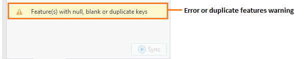

.. index::
	single: Running the tool

****************
Running the tool
****************

The operation of the Data Sync tool is explained in this section. This user guide is specific to the ArcGIS Pro version of the tool.

As discussed in the :doc:`Setting up the tool <../setup/setup>` section, the Data Sync tool is operated from a GIS project file within which the data required to run the tool is already loaded in the active map window. Therefore, before running the tool, ensure the following conditions are met:

- A GIS project has been created which contains the local feature layer in a map window.
- The tool XML configuration file 'DataSync.xml' has been set up and is named correctly.
- One or more user XML profiles have been set up and are in the same folder as the tool XML file.
- The Data Sync tool has been installed and set up.

.. seealso::
	Please refer to the :doc:`Setting up the tool <../setup/setup>` section for further information about any of these requirements.

.. raw:: latex

   \newpage

.. index::
	single: Opening the tool

Opening the tool
================

To open the Data Sync tool in ArcGIS Pro, open the **Tools** menu bar and click on the **Data Sync tool** button (:numref:`figLaunch`).

.. _figLaunch:

	Launching the Data Sync tool in ArcGIS Pro

.. note::
	Once the tool has been opened the window pane will remain open unless it is manually closed. As with other dockable windows in ArcGIS Pro, the window can docked anywhere in the ArcGIS Pro application and can be pinned or hidden when not in use.

.. raw:: latex

   \newpage

.. index::
	single: Initial set-up

Initial set-up
==============

In order to function, the tool needs to know the location of the XML configuration files. The first time
the tool is run, or whenever the configuration file is moved, the user must specify the folder containing
the XML files.

Click on the 'Open folder' button (:numref:`figOpenXMLFolderButton`).

.. _figOpenXMLFolderButton:

	Click on the Open Folder button

Then navigate to the folder containing the XML files and click OK. If the tool XML file is present and its
structure is correct, the list of user profiles will appear in the drop-down list (:numref:`figSelectConfigFolder`).

.. _figSelectConfigFolder:

	Locating the configuration file folder

.. note::
	The location of the configuration folder will be stored for future use.

.. raw:: latex

   \newpage

.. index::
	single: Loading a profile

Loading a profile
=================

If more than one user XML profile is found, and the tool configuration file is configured to allow the user
to choose the XML profile, then the **Profile** tab will appear to allow the user to choose an XML profile (:numref:`figSelectXMLProfile`).

.. _figSelectXMLProfile:

	Example list of XML profiles to select

Select a profile and click 'Load' to start the tool using that profile. If there are any structural issues
with the selected XML profile, the tool will display a message with the error it has encountered, and not
load any further (:numref:`figLaunchWarning`).

.. _figLaunchWarning:

	Example warning message displayed for any XML structural issues

.. raw:: latex

   \newpage

Provided that the selected XML profile is otherwise correct, the **Sync** tab will display 
(:numref:`figDisplayForm`).

.. _figDisplayform:

	The form displaying summary counts of the local layer and remote table

.. note::
	If there is only one user XML profile, or if the tool configuration file is configured to **not** allow
	the user to choose the XML profile, then the default XML profile will lead automatically (if found).

.. raw:: latex

   \newpage

If the local layer specified in the XML profile is not present in the active map window then a warning message will appear on the form (:numref:`figMissingLayerWarning`).

.. _figMissingLayerWarning:

	Example warning message that the local layer is missing

.. raw:: latex

   \newpage

.. index::
	single: Using the form; Reviewing the table counts

Reviewing the table counts
==========================

Review the counts for the local layer and remote table in the ``Table Counts`` list (:numref:`figTableCounts`) to ensure that the record, error and duplicate counts are as anticipated (e.g. a if number of sites have been added to the local layer is the local count is greater than the remote count).

.. _figTableCounts:

	Example of record, error and duplicate counts for each table

If there are any features in the local layer with null, blank or duplicate unique keys then a warning message will appear on the form (:numref:`figErrorFeaturesWarning`).

.. _figErrorFeaturesWarning:

	Warning message of errors in the local layer

If any updates to the local layer are required to address any errors then these can be applied by editing the local layer as normal.

To refresh the table counts, e.g. after the local layer has been updated, click on the **Refresh** button (:numref:`figRefreshButton`):

.. _figRefreshButton:

	Refresh button to refresh the table counts

.. index::
	single: Using the form; Comparing the data

Comparing the data
==================

To perform a detailed comparison between the local layer and remote table click the **Compare** button (:numref:`figCompareButton`).

.. _figCompareButton:

	Compare button to perform comparison between local layer and remote table

During the compare process a copy of the local layer will be uploaded to the remote database and then a stored procedure will be executed to compare that copy with the remote table.

Once the comparison has finished the results will appear in the ``Result Summary`` list (:numref:`figResultSummary`):

.. _figResultSummary:

	Example of summary of comparison results

There are up to 8 different types of result that may appear (depending on the updates performed to the local layer):

- **Empty** ... No boundary has been set for a feature.
- **Error** ... The unique ID for a feature is blank or null.
- **Duplicate** ... The unique ID has been used for two or more features.
- **Added** ... A feature with a new unique ID and boundary has been added.
- **Edited** ... The boundary for a feature has been edited.
- **Renamed** ... The unique ID for a feature has been changed (but not the boundary).
- **Deleted** ... A feature has been deleted.
- **Orphan** ... A feature has a unique ID not found in the ``master`` table.

.. note:: 
	Which type of results can appear will depend on the logic in the bespoke stored procedure used to perform the comparison and the structure of the remote database.

The remote table will also be added to the active map if it is not already loaded. This is so that the features in the local layer and remote table can be viewed together.

Click on a row to view a list of all of the features for that result type (:numref:`figResultDetails`):

.. _figResultDetails:

	Example of details for a result type

Double-click on a row to zoom to the location for that feature in the active map.

.. note::
	Double-clicking on an ``Empty`` feature will not have any effect because the feature has not spatial location.

.. note::
	Double-clicking on a ``Deleted`` feature will zoom to the location of the feature in the remote table.

.. raw:: latex

   \newpage

At this point if any updates to the local layer are required these can be applied by editing the local layer as normal.

.. caution::
	It is important that the comparison is re-run, by clicking the **Compare** button again, before proceeding to ensure that a copy of the local layer is reloaded to the remote database.

Finally, select whether the log file should be overwritten, and whether the log file should be opened upon completion (:numref:`figLogFileOptions`). Now the form is set up to run the synchronisation.

.. _figLogFileOptions:

	Select the log file options

.. raw:: latex

   \newpage

.. index::
	single: Using the form; Running the synchronisation

Running the synchronisation
===========================

Finally, when the user is satisfied that the differences between the local and remote copies are as expected click the **Sync** button.

If there are still any features in the local layer with null, blank or duplicate unique keys then a warning message will appear (:numref:`figSyncWarning`).

.. _figSyncWarning:

	Warning message of errors in the local layer

To proceed with the synchronisation click `Yes`.

Once the synchronisation is complete the log file will be opened (:numref:`figLogFile`), if required, so that you can check the process has completed correctly.

.. _figLogFile:

	The log file shown when the sync finishes
