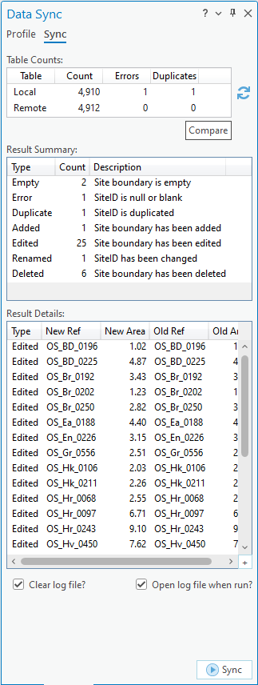
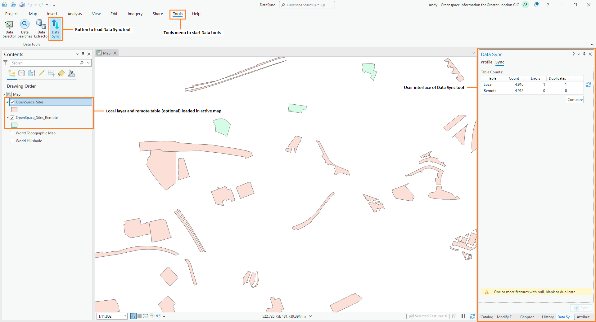

************
Introduction
************

.. index::
	single: Background

Background
==========

Although viewing spatial and non-spatial data in SQL Server is simple with ArcGIS Pro, you cannot connect directly to a SQL Server database from ArcGIS Pro and edit the data. To edit database data you must publish it as an editable web feature layer and then edit through the feature layer. To facilitate maintaining spatial data in SQL Server the **Data Sync** tool has been developed. It provides an alternative way of editing data in SQL Server without first needing to publish the data as an editable web feature layer. Instead, a local copy of the data is stored as a shapefile or geodatabase feature class that can be edited normally in ArcGIS Pro, and then the remote copy in SQL Server can be synchronised from the local copy using the tool. 

.. index::
	single: Overview

Tool overview
=============

The Data Sync tool presents a simple user interface (:numref:`figUI`) to assist users to compare and review update to a local feature layer and to then synchronise those updates with the remote layer on SQL Server. It is integrated into the user interface of the installed GIS application - appearing as an add-in tool button.

.. _figUI:

	The Data Sync tool interface

The tool references an existing 'local' GIS layer (this can be points, lines or polygons) and a 'remote' copy of the layer stored as a SQL Server spatial table. It can then compare the local layer with the remote copy to highlight how they differ, and then it can add, delete and update the features in the remote copy using the local copy as a source. It creates a log file after each sync process which summarises the differences between the layers. The process is discussed in more detail in the section on :doc:`Running the tool <../execute/execute>`.

.. index::
	single: Overview; Comparison

Comparison
----------

The comparison between the local and remote copies is performed by copying a temporary copy of the local data to SQL Server and then triggering a bespoke stored procedure to compare the two datasets and summarise the differences. A summary of the results from the stored procedure will then be displayed in the tool user interface. Details of each specific difference (inserted, deleted and edited features) can then be display and examined in more detail by the user.

As well as checking for inserted, deleted and edited features the comparison stored procedure can also check for other scenarios, e.g.:
* **Empty** - where the feature geometry is null.
* **Error** - where the unique feature ID is null or blank.
* **Duplicate** - where the unique feature ID is used by two or more features.
* **Orphan** - where the unique feature ID is not in a related 'master' data table.

.. Note::
	If the results of the comparison are not as expected the user can re-edit the local copy and re-run the comparison as required.

.. index::
	single: Overview; Synchronisation

Synchronisation
---------------

Once the user is satisfied that the differences between the local and remote copies are as expected they can perform a sync to update the remote copy. The sync is performed by triggering another bespoke stored procedure to apply each inserted, deleted and edited feature in the remote copy from the temporary local copy.

.. Note::
	Additional functionality can be performed in SQL Server if required, by the stored procedure or by bespoke table 'triggers', e.g. to set read-only attributes such as the area, easting or nothing of features, or create history records for each update.

.. caution::
	Empty, error and orphan features will not be synced to the remote data.

.. raw:: latex

   \newpage

.. index::
	single: Tool; Components

The Data Sync tool
==================

Components
----------

There are four component parts to the Data Sync tool that work together to automate the process described above:

1. A local layer containing the spatial features.
#. A SQL Server database containing the remote table, the bespoke compare and sync stored procedures, and any other require components (e.g. bespoke table triggers).
#. One or more user XML profiles that specifies how the tool is configured.
#. The Data Sync tool ArcGIS Pro add-in.

The Data Sync tool is used within a GIS environment with the specified local layer to be used loaded in the active map (see :numref:`figInterfaceAnnotated`). 

.. _figInterfaceAnnotated:

	Example of an ArcGIS Pro map configured for the Data Sync tool

.. index::
	single: Tool; Configuration

Configuration
-------------

Defining the local layer and remote table, the names of the bespoke stored procedures, and the key columns for the data, is done via a user configuration file written in XML. Using this file the user can configure all the parts of the comparison and sync, for example:

* The name of the local layer containing the spatial features.
* The name of the remote table in SQL Server.
* The name of the SQL Server bespoke stored procedures to execute to perform the comparison and sync.
* The name of the key and spatial columns in the local layer and remote table.
* SQL clauses to apply to the local layer and remote table to filter the selection (if required).

An example of the XML file is included in the :doc:`Appendix <../appendix/appendix>`, and the process of setting up this file is discussed in the section on :doc:`Setting up the tool <../setup/setup>`.

The following chapters, :doc:`Setting up the tool <../setup/setup>` and :doc:`running the tool <../execute/execute>`, will guide you through setting up and operating the tool.
