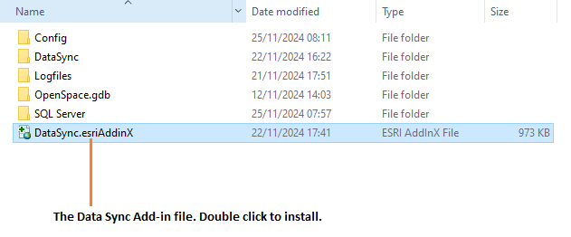
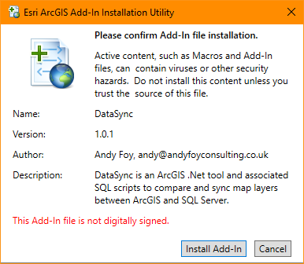
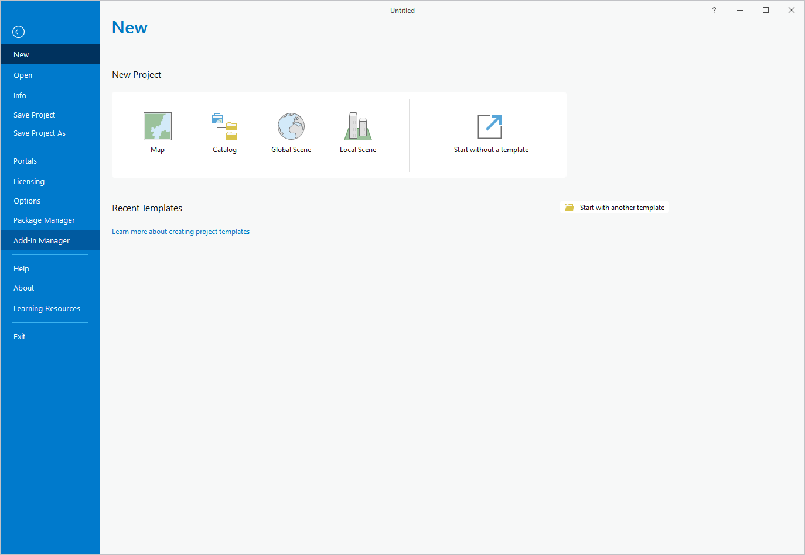
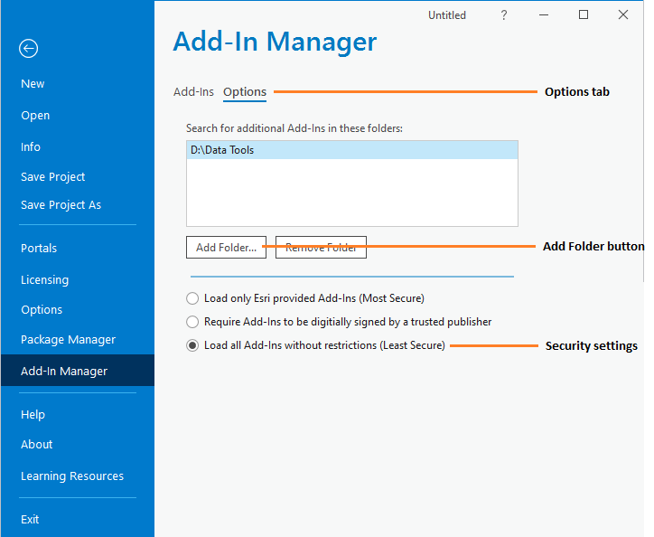
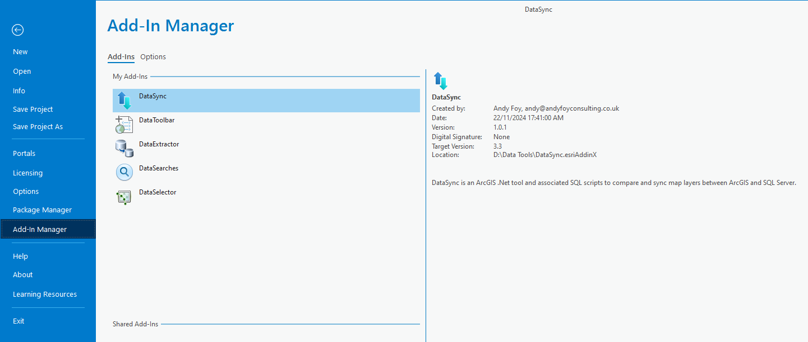

*******************
Setting up the tool
*******************

Before the Data Sync tool will function, it needs to be installed and configured. It is recommended that the configuration is carried out first, although the steps are interchangeable. 

.. index::
	single: Configuration

Configuring the tool
====================

There are two configuration files used by the tool. They must be in the same folder.

.. index::
	single: Configuration; Tool configuration file

Tool configuration file
-----------------------

This configuration file must be named 'DataSync.xml' and it must be present for the tool to load. It allows the user to control which configuration file to load, and contains just three settings:

ChooseXML
	Is the user allowed to choose their own configuration file? (Yes/No)

DefaultProfile
	What the default XML file called is called. If blank, the tool looks for DefaultProfile.xml.

HelpURL
	The URL of the online user guide (this guide).

.. caution:: 
	The name of this configuration file must be 'DataSync.xml'. The tool will not load if the file is not found.

.. index::
	single: Configuration; User configuration files

User configuration profiles
---------------------------

These configuration files must be in the same folder as the tool configuration file. There can be as many profiles as you wish, each with different options and default settings. Each file contains all of the user options and default settings for the tool including what layers and columns are called and other general settings. Attributes and settings are presented as nodes (beginning with a start node, e.g. ``<example>``, and finishing with an end note, e.g. ``<\example>``), with the value for the setting held between the ``<value>`` and ``<\value>`` tag. 

.. note::
	The XML profiles can have any name prefix as long as they have a '.xml' file extension.

The XML file can be edited in a text editor such as Notepad.

.. caution::
	It is important that the structure of the file is maintained as it is presented in the :doc:`Appendix <../appendix/appendix>`. Any changes to the structure may result in the Data Sync tool not loading, or not working as expected.

Once editing has been completed and the edits have been saved, it is recommended that the configuration file is opened using an internet browser such as Edge which will help highlight any editing errors – only if the structure of the file is valid will the whole file be displayed in the internet browser.

.. note::
	It is recommended that the configuration file is kept in a central (network) location, so that all users use the same configuration.

Details on the required attributes in this file are given below. This version of the configuration details is valid for the ArcGIS Pro version of the Data Sync tool.

LogFilePath
	The existing file location where log files will be saved with output messages.

SDEFile
	The location of the SDE file that specifies which SQL Server database to connect to.

DatabaseSchema
	The schema used in the SQL Server database.

CompareStoredProcedure
	The stored procedure to compare the local layer and remote table in SQL Server.

UpdateStoredProcedure
	The stored procedure to update the remote table in SQL Server.

ClearStoredProcedure
	The stored procedure to clear the temporary tables in SQL Server.

LocalLayer
	The name of the local layer in GIS containing the features.

LocalClause
	The local layer selection where clause (if required).

RemoteTable
	The name of the remote table in SQL Server containing the features.

RemoteClause
	The remote table selection where clause (if required).

RemoteLayer
	The name of the layer in GIS displaying the remote features from SQL Server.

KeyColumn
	The name of the key column in the local layer and remote table.

SpatialColumn
	The name of the spatial column in the local layer and remote table.

DefaultClearLogFile
	By default, should an existing log file be cleared?

DefaultOpenLogFile
	By default, should the log file be opened after running.

.. index::
	single: Special characters in XML

.. raw:: latex

   \newpage

Special characters in XML
-------------------------

The characters ``&``, ``<`` and ``>`` are not valid within values and, so in order to be used, must be **escaped** with XML entities as follows:

<
	This must be escaped with ``&lt;`` entity, since it is assumed to be the beginning of a tag. For example, ``RecYear &lt; 2010``

>
	This should be escaped with ``&gt;`` entity. It is not mandatory -- it depends on the context -- but it is strongly advised to escape it. For example, ``RecYear &gt; 1980``

&
	This must be escaped with ``&amp;`` entity, since it is assumed to be the beginning of a entity reference. For example, ``TaxonGroup = 'Invertebrates - Dragonflies &amp; Damselflies'``

.. raw:: latex

   \newpage

.. index::
	single: Installation

Installing the tool
===================

Installing the tool in ArcGIS Pro is straightforward. There are two ways it can be installed:

.. note::
	Before installing the tool you will need to install another ArcGIS Pro add-in 'DataToolbar'. This add-in with simply create a new 'Tools' toolbar onto which the Data Sync tool and other Data tools will be added once installed. To install the toolbar follow the instructions below using the DataToolbar add-in.

.. index::
	single: Installation; via Windows Explorer

Installation through Windows Explorer
-------------------------------------

Open Windows Explorer and double-click on the ESRI Add-in file for the Data Sync tool (:numref:`figInstallTool`).

.. _figInstallTool:

	Installing the Data Sync tool from Windows Explorer

.. raw:: latex

   \newpage

Installation will begin after confirming you wish to install the tool on the dialog that appears (:numref:`figConfirmInstall`).

.. _figConfirmInstall:

	Installation begins after clicking 'Install Add-in'

Once it is installed, it will appear in the Add-In Manager and on the 'Tools' menu bar.

.. note::
	The 'Tools' menu bar will only appear once the DataToolbar add-in has also been installed.

.. caution::
	In order for this process to work all running ArcGIS Pro sessions must be closed. The tool will not install or install incorrectly if there are copies of ArcGIS Pro running.

.. raw:: latex

   \newpage

.. index::
	single: Installation; within ArcGIS Pro

Installation from within ArcGIS Pro
-----------------------------------

Firstly, open ArcGIS Pro and go to the Add-In Manager through the Project menu (:numref:`figOpenAddInManager`).

.. _figOpenAddInManager:

	Starting the ArcGIS Add-In Manager

.. raw:: latex

   \newpage

If the Data Sync tool is not shown, use the **Options** tab to add the folder where the tool is kept (:numref:`figAddInOptions`). The security options should be set to the lowest setting as the tool is not digitally signed.

.. _figAddInOptions:

	The 'Options' tab in the ArcGIS Pro Add-In Manager

.. note::
	Adding a network folder in the options tab will mean that all ArcGIS Pro add-ins in that folder, and all sub-folders, will be loaded when ArcGIS Pro starts.

After restarting ArcGIS Pro the tool will show in the Add-In Manager (:numref:`figAddInManager`) and on the 'Tools' menu bar.

.. _figAddInManager:

	The ArcGIS Pro Add-In Manager showing the Data Sync tool

.. note::
	The 'Tools' menu bar will only appear once the DataToolbar add-in has also been installed.
